# kbx IR Blaster

## Image Gallery

Click on an image to see the high-resolution version.

[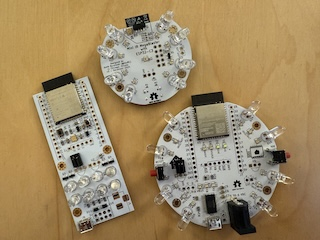](images/kbxIrBlaster-top-family.jpg)

### v3

[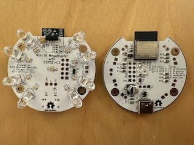](images/kbxIrBlaster-v3.jpg)

[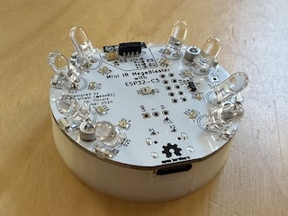](images/kbxIrBlaster-v3-top-mounted.jpg)

[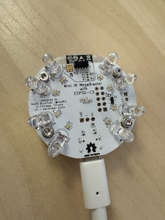](images/kbxIrBlaster-v3-top-plugged.jpg)

[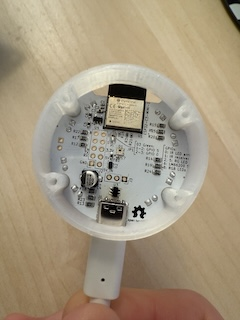](images/kbxIrBlaster-v3-bottom-mounted.jpg)

[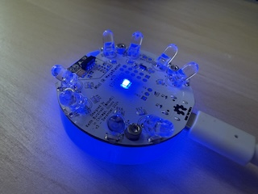](images/kbxIrBlaster-v3-glow.jpg)

### v2

[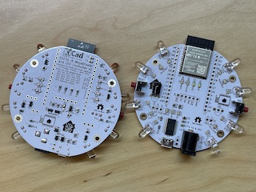](images/kbxIrBlaster-v2.jpg)

As seen with the Raspberry Pi NOIR camera:

[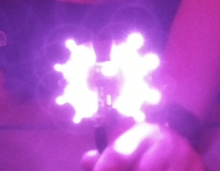](images/kbxIrBlaster-v2-IR.jpg)

### v1

[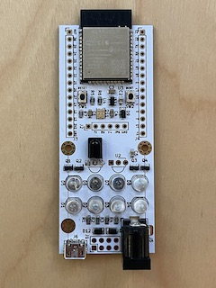](images/kbxIrBlaster-v1.3-top.jpg)

[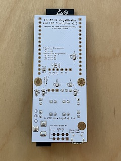](images/kbxIrBlaster-v1.3-bottom.jpg)

[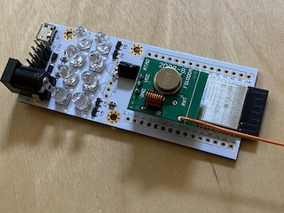](images/kbxIrBlaster-v1.3+fs1000a.jpg)