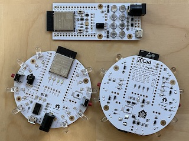

# kbx IR Blaster

## What?

Just another ESP32-based IR Blaster. It was designed with
 [ESPHome](https://esphome.io) in mind but should work fine with
 [Tasmota](https://tasmota.github.io/docs/) or any other app, really.

I've created two versions:
 - [v1](v1/)
   - Rectangular
   - Up to four external control channels
   - Pads for up to eight through-hole LEDs, front- and/or back-facing
 - [v2](v2/)
   - Disc
   - One external control channel
   - Pads for surface mount LEDs on top of the PCB and pads for through-hole
     LEDs around perimeter of PCB, allowing LEDs to be oriented in nearly any
     direction

More images can be found in the [images](images/) directory of this repository.

## Why?

After trying this on a perfboard with parts I had laying around, I wanted
 something more polished and more powerful. I found
 [Sparkfun's IR Blaster](https://www.sparkfun.com/products/15031) which is
 quite nice, tiny and clean but I quickly realized that its IR output is
 somewhat weak and would only work if pointed _directly_ at the device it was
 intended to control. Rather than hack it up, I chose to draw up my own
 versions of such a thing. My goal was to make them substantially more powerful
 in an effort to "light up a room" with infrared light; that is, you'll
 probably find that they work well even when not specifically directed at (if
 even near) devices you wish to control. I've used an ESP32 module instead of
 an ESP8266, as the ESP32 has dedicated hardware for IR data transmission (the
 RMT) which makes it more suitable for this purpose, despite that it is
 otherwise quite overkill.

## How?

Please see the bill of materials (BoM) for the version of interest:
 -  v1 BoM: [Octopart](https://octopart.com/bom-tool/vDwq4wDr), [CSV](v1/kbxIrBlaster_bom.csv)
 -  v2 BoM: [Octopart](https://octopart.com/bom-tool/78rYOXWE), [CSV](v2/kbxIrBlaster_bom.csv)

I had the PCBs fabricated by [Elecrow](https://www.elecrow.com) but
 nearly any PCB fabricator should be able to manufacture these without any
 issues.

The schematic and PCB were drawn in [KiCAD](https://www.kicad.org).

The PCBs have on the bottom side a number of solder jumpers that enable each of
 the FET drivers to be connected to one of two possible GPIO pins. This
 allows a single GPIO pin to control all LEDs simultaneously or they can be
 broken apart onto separate GPIO pins. Labels on the underside of the PCBs
 indicate what jumpers are connected to what LEDs.

_Note that the solder jumpers **must be bridged** one way or the other; if this
 is not done, the FETs (and consequently the LEDs they drive) will not activate!_
 When you build one, be sure to complete this step or you'll be left in the
 dark. (Punny, I know.)

An FS1000A (such as
 [this one](https://www.amazon.com/HiLetgo-Wireless-Transmitter-Receiver-Raspberry/dp/B01DKC2EY4/))
 or similar 433 MHz transmitter module may be connected as indicated on the PCB
 allowing the device to double as an RF remote controller. On the [v1](v1/)
 PCB, bridge JP6 to enable this and then connect the module to pins 4, 5, and
 6 on J2. On the [v2](v2/) PCB, simply connect the transmitter to J8. When
 doing so, be sure to orient the module correctly or tragedy may result.

After building, see my
[ESPHome-configs](https://github.com/kbx81/esphome-configs) repository for
example [ESPHome](https://esphome.io) configuration you may use with your IR
blaster. Enjoy!

 ## Legal stuff and License

The circuit schematics and PCB found here are licensed under the
 [Creative Commons Attribution-ShareAlike 4.0 International License](http://creativecommons.org/licenses/by-sa/4.0/).

_Happy building!_
